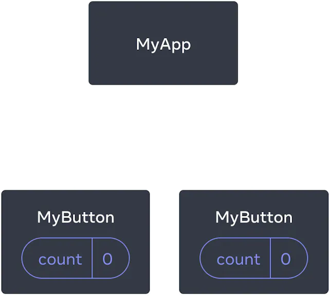
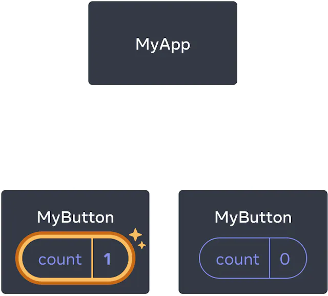
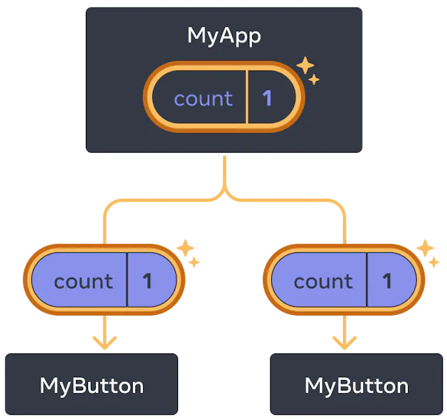

# 빠르게 시작하기

🔗 https://react.dev/learn

<br/>

## 1. 컴포넌트 생성 및 중첩하기

```js
function MyButton() {
  return <button>I'm a button</button>;
}

export default function MyApp() {
  return (
    <div>
      <h1>Welcome to my app</h1>
      <MyButton />
    </div>
  );
}
```

- React 컴포넌트는 대문자로 시작
- HTML 태그는 소문자로 시작

<br/>

## 2. JSX로 마크업 작성하기

**_JSX vs JS?_**

- jsx는 렌더링 로직과 콘텐츠를 한 파일에 포함한다.

**_JSX vs HTML?_**

- jsx는 닫는 태그를 **꼭** 포함해야 한다.

```js
function App() {
  return (
    <div>
      <p>안녕하세요</p>
      <hr> <!-- 에러!!!! -->
    </div>
  );
}
```

```html
<!DOCTYPE html>
<html lang="en">
  <head>
    <meta charset="UTF-8" />
    <meta name="viewport" content="width=device-width, initial-scale=1.0" />
    <title>Document</title>
  </head>
  <body>
    <p>안녕하세요</p>
    <hr />
    <!-- ok -->
  </body>
</html>
```

- 컴포넌트를 여러 개의 JSX 태그를 반환할 수 없다.
- 여러 태그를 반환하기 위해서는 `<div>...</div>` 또는 `<>...</>`로 감싸주어야 한다.

<br/>

## 3. 스타일 추가하기

- React에서는 CSS 클래스 지정을 위해 `classname` 사용
- Js의 `class`와 동일

<br />

## 4. 데이터 표시하기

- 중괄호 `{}`를 사용하여 자바스크립트로 '이스케이프 백'할 수 있다.

> ## **_이스케이프 백(escape back)_**
>
> - JSX 코드 내에서 Javascript 표현식을 사용하는 법
> - Escape into Javascript from JSX attributes

```js
// jsx 코드 내에서 사용한 예시
return <h1>{user.name}</h1>;
```

```js
// jsx 어트리뷰트 내에서 사용한 예시
return ;
```

- 스타일이 동적으로 변하는 경우 `style` 어트리뷰트를 사용한다.

```js
const user = {
  name: 'Hedy Lamarr',
  imageUrl: 'https://i.imgur.com/yXOvdOSs.jpg',
  imageSize: 90,
};

export default function Profile() {
  return (
    <>
      <h1>{user.name}</h1>
      
    </>
  );
}
```

<br />

## 5. 조건부 렌더링

**1) if문**

```js
let content;
if (isLoggedIn) {
  content = <AdminPanel />;
} else {
  content = <LoginForm />;
}
return <div>{content}</div>;
```

**2) 조건부 삼항 연산자**

```js
<div>{isLoggedIn ? <AdminPanel /> : <LoginForm />}</div>
```

**3) && 연산자**

- `else` 분기가 필요하지 않은 경우

```js
<div>{isLoggedIn && <AdminPanel />}</div>
```

<br />

## 6. 리스트 렌더링하기

- for문 또는 `map()` 함수 사용

```js
const products = [
  { title: 'Cabbage', id: 1 },
  { title: 'Garlic', id: 2 },
  { title: 'Apple', id: 3 },
];

const listItems = products.map((product) => <li key={product.id}>{product.title}</li>);

return <ul>{listItems}</ul>;
```

- `key` 어트리뷰트를 통해 리스트 내의 요소들끼리 구별한다. (보통 데이터베이스 ID값 사용)
- React는 이 key값을 나중에 삽입, 삭제, 재정렬이 일어났을 때 활용한다.

<br />

## 7. 이벤트에 응답하기

- 컴포넌트 내에 이벤트 핸들러를 선언함으로써 이벤트에 응답할 수 있다.

```js
function MyButton() {
  function handleClick() {
    alert('You clicked me!');
  }

  return <button onClick={handleClick}>Click me</button>;
}
```

- `handleClick`에 괄호 `()`를 붙이지 않는 것에 주목
- 이벤트 핸들러 함수를 부르는 것이 아니라 그저 함수를 컴포넌트에 내려준다.(pass it down)
- React가 알아서 유저가 버튼을 클릭했을 때 이벤트 핸들러 함수를 호출한다.

<br />

## 8. 화면 업데이트하기

- 컴포넌트가 정보를 기억하고 표시하게 하기 위해 `state`를 추가한다.

```js
import { useState } from 'react';
function MyButton() {
  const [count, setCount] = useState(0);
  // ...
```

- 현재 상태 (`count`), 현재 상태를 갱신시키는 함수 (`setState`)로 구성
- 현재 상태를 변경하고자 한다면 `setState`에 새로운 값을 전달한다.
- 만약 같은 컴포넌트를 여러 번 호출한다면, 각 컴포넌트는 자신만의 상태를 독립적으로 갖는다.

```js
export default function MyApp() {
  return (
    <div>
      <h1>Counters that update separately</h1>
      <MyButton /> <!-- count 수 1번과 -->
      <MyButton /> <!-- count 수 2번은 다르다. -->
    </div>
  );
}
```

<br />

## 9. Hooks 사용하기

- `use`로 시작하는 함수를 **_Hooks_**라고 부른다. (`useState`도 훅의 일종)
- 훅은 컴포넌트의 최상위 레벨에서만 호출할 수 있다.
- 따라서 훅을 조건문이나 반복문 안에 쓰고자 한다면 컴포넌트로 추출하여 그곳에서 사용하는 것이 바람직하다.

ex. Bad Component

```js
function BadComponent() {
  if (someCondition) {
    const [state, setState] = useState(initialState); // 규칙 위반
  }
  // ...
}
```

ex. Good Component

```js
function GoodParentComponent() {
  if (someCondition) {
    return <ChildComponent />;
  }
  return null;
}

function ChildComponent() {
  const [state, setState] = useState(initialState); // 굿!
  // ...
}
```

<br />

## 10. 컴포넌트간의 데이터 공유하기

- 위의 예시에서는 각각의 컴포넌트에 `count`가 존재했기 때문에 컴포넌트끼리 값을 공유하지 않았다.

|    초기상태(count 0)     |        버튼 클릭         |
| :----------------------: | :----------------------: |
|  |  |

> ## **_컴포넌트들이 같은 값을 공유하고 동시에 갱신할 수 있도록 하는 방법_**
>
> - `count`를 모든 컴포넌트들을 포함하고 있는 상위 컴포넌트에서 정의한다.
>
> |  | 버튼을 클릭하면 MyApp의 count값이 갱신되고 자식 컴포넌트(MyButton)로 그 값을 전달한다. |
> | :----------------------- | :------------------------------------------------------------------------------------: |

<details>
<summary>code</summary>
<div markdown="1">

```js
import { useState } from 'react';

export default function MyApp() {
  const [count, setCount] = useState(0);

  function handleClick() {
    setCount(count + 1);
  }

  return (
    <div>
      <h1>Counters that update together</h1>
      <MyButton count={count} onClick={handleClick} />
      <MyButton count={count} onClick={handleClick} />
    </div>
  );
}

function MyButton({ count, onClick }) {
  return <button onClick={onClick}>Clicked {count} times</button>;
}
```

</div>
</details>

- 컴포넌트에 상태(`count`)와 이벤트 핸들러(`handleClick`)를 전달한다.
- 이렇게 컴포넌트에 전달하는 정보들을 `props`라고 부른다.
