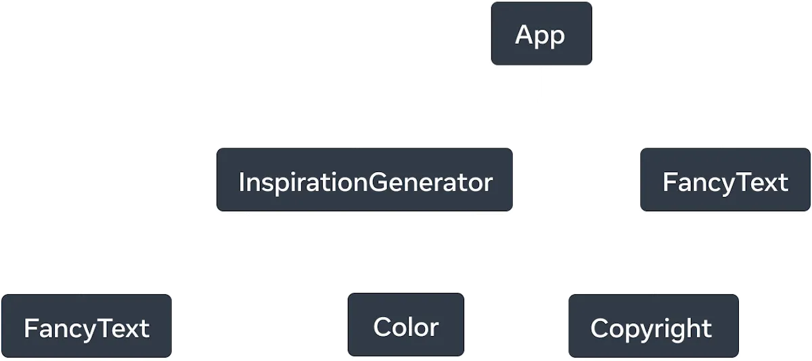

# UI로 표현하기
🔗 https://react.dev/learn/describing-the-ui

&nbsp;&nbsp;모든 UI는 버튼, 텍스트, 이미지와 같은 작은 단위로 나눌 수 있다. React를 이용해 이러한 요소들을 재사용 가능하고 중첩 가능한 컴포넌트로 만들 수 있다.

<br />

## 첫 컴포넌트
- markup, css, javascript를 활용해 UI를 제작할 수 있다.
- React는 이렇게 만든 UI를 재사용 가능하도록 커스텀화된 컴포넌트를 제공한다.
- React는 상호작용성을 가장 중요하게 생각한다.
    - 원문 "a React component is a JavaScript function that you can sprinkle with markup"
    - React는 JS 함수로(상호작용성을 중시) 마크업 언어를 추가적으로 활용할 수 있다.

>***컴포넌트 빌드하기***
>
> 1. 컴포넌트 내보내기
>    - `export default`를 사용하여 함수를 다른 파일에서 `import`해 사용 가능하도록 한다.
>
> 2. 함수 정의하기
>    - 대문자로 시작하는 자바스크립트 함수를 정의한다.
>
> 3. 마크업 추가하기
>    - `html` 태그처럼 보이는 `jsx` 문법을 사용해 마크업을 작성한다.
>    - `jsx`는 javascript 안에 마크업을 작성할 수 있도록 한다.

- 이렇게 빌드한 컴포넌트는 다른 컴포넌트에서 중첩하여 사용할 수 있다.
- 컴포넌트의 정의는 중첩되어선 안된다.
    <details>
    <summary>code</summary>
    <div markdown="1">

    ```js
    // 🔴 Never define a component inside another component!
    export default function Gallery() {
    function Profile() {
        // ...
    }
    // ...
    }

    // ✅ Declare components at the top level
    export default function Gallery() {
    // ...
    }

    function Profile() {
    // ...
    }
    ```

    </div>
    </details>

<br />

## 컴포넌트 import 및 export하기
- 기본적으로 `App.js`라는 루트 컴포넌트가 존재한다.
- Next.js와 같이 파일 기반으로 라우팅하는 프레임워크의 경우 각 페이지에 따라 루트 컴포넌트가 다를 수 있다.
- 컴포넌트를 파일로 분리하는 법

    1. 별도의 JS 파일을 만들어 컴포넌트를 작성한다.
    2. 컴포넌트를 export한다. (named/default 방식 사용 가능)
    3. export 방식에 맞춰 필요한 곳에서 import한다.
- 
    <details>
    <summary>named / default export </summary>
    <div markdown="1">

    

    <ol>
    <li>
    named export (유명 내보내기)
    <ul>
    <li>모듈 내에서 여러 개 존재 가능</li>
    <li>import할 때는 export할 때와 동일한 이름을 사용한다.</li>
    <li>구조분해할당(<code>{}</code>)을 사용해 가져온다.</li>
    </ul>
    </li>
    <br />
    <li>
    default export (기본 내보내기)
    </li>
    <ul>
    <li>모듈 당 하나만 존재 가능</li>
    <li>import할 때 원하는 이름 지정 가능</li>
    <li>중괄호 없이 가져온다.</li>
    </ul>
    </ol>
    </div>
    </details>

<br />

## JSX로 마크업 작성하기
> JSX는 Javascript 파일 내에 Html과 비슷한 마크업을 작성하도록 js를 확장한 문법이다.

- 전통적인 웹은 컨텐츠는 html에, 상호작용을 위한 로직은 js에 별도의 파일으로 작성한다.
- 그러나 상호작용성이 중시되면서, 로직(js)이 컨텐츠(html)를 결정하게 되었다.
- 이에 React는 하나의 파일(컴포넌트) 안에 렌더링 로직과 마크업을 함께 작성한다.

### JSX 규칙
***1. 하나의 요소만 리턴한다.***
- 여러 요소를 함께 반환해야 하는 경우 `<>...</>` 또는 `<div>...</div>`로 묶어서 반환
- `<>...</>`(***Fragment***): html tree에 영향을 끼치지 않고 그룹화
> ***왜 하나만 리턴해야 할까?***
> - jsx는 js로 변환되는데
> - js는 여러 객체의 반환을 허용하지 않는다. (여러 객체를 반환할 때 배열로 묶어야 하는 것처럼)

***2. 모든 태그는 닫아야 한다.***
- jsx는 모든 태그를 명시적으로 닫을 것을 요구한다.
- html은 안 닫아도 되는 것들이 있다. (ex. `br`, `hr`, `img`...)

***3. camelCase 사용하자.***
- js 예약어는 사용 불가하다. (ex. `class` -> `className`)
- `stroke-width` -> `strokeWidth`
- 그냥 [컨버터](https://transform.tools/html-to-jsx) 사용하자

<br />

## 중괄호를 사용해 JSX에서 JS 사용하기
- 따옴표(`''` or `""`)로 묶어서 문자열을 전달한다. (ex. `alt="Gregorio Y. Zara"`)
- js로부터 값을 가져와 지정하려면 따옴표를 `{}`로 교체한다. (ex. `alt={description}`)
- {}로 값 또는 함수를 전달할 수 있다. (ex. `<h1>To Do List for {formatDate(today)}</h1>`)
- `{{}}`: 객체를 전달할 때 한번 더 중괄호로 묶어준다. 

    ```
    <ul style={{backgroundColor: 'black', color: 'pink'}}>
    ```
- 객체 내의 필드를 `.`을 사용해 전달할 수 있다. 
    ```js
    const person = {
        name: 'Gregorio Y. Zara',
        theme: {
            backgroundColor: 'black',
            color: 'pink'
        }
    };

    // ...
    <div style={person.theme}>
      <h1>{person.name}'s Todos</h1>
    </div>
    // ...
    ```

<br />

## 컴포넌트에 props 전달하기
- `props`란 jsx 태그에 전달할 수 있는 정보이다.
    - ex. `` 태그의 경우 `className`, `src`, `alt`와 같은 미리 선언된 props를 전달할 수 있다.
- 사용자 정의 컴포넌트에도 어떤 props든 전달 가능하다.
    1. 자식 컴포넌트에 props 전달하기 
    ```js
    export default function Profile() {
        return (
            <Avatar
            person={{ name: 'Lin Lanying', imageId: '1bX5QH6' }}
            size={100}
            />
        );
    }
    ```
    2. 자식 컴포넌트에서 props 읽기
    - 이름 `persons`, `size를` `({})` 로 구조분해할당하여 사용 가능하다.
    ```js
    function Avatar({ person, size }) {
    // person and size are available here
    }
    ```
    - 사실 하나의 매개변수만이 컴포넌트로 전달된다. 따라서 아래와 같이도 사용 가능하다.
    ```js
    function Avatar(props) {
        let person = props.person;
        let size = props.size;
        // ...
    }
    ```
- prop에 default 값을 지정 가능하다.
```js
function Avatar({ person, size = 100 }) {
  // ...
}
```
- 자신의 모든 props를 그대로 자식에게 전달할 때, spread 연산자를 사용할 수 있다. 그러나 이러한 표현은 제한적으로 사용해야 하며 컴포넌트를 분리해 JSX를 전달해야 하는 것일 수도 있다.
```js
// 반복 ...
function Profile({ person, size, isSepia, thickBorder }) {
  return (
    <div className="card">
      <Avatar
        person={person}
        size={size}
        isSepia={isSepia}
        thickBorder={thickBorder}
      />
    </div>
  );
}
// 간결!
function Profile(props) {
  return (
    <div className="card">
      <Avatar {...props} />
    </div>
  );
}
```
- props로 JSX 전달하기?
```js
<Card>
  <Avatar />
</Card>

// children prop에 Avatar 컴포넌트를 설정한다.
function Card({ children }) {
  return (
    <div className="card">
      {children}
    </div>
  );
}
```
- props는 시간에 따라 변할 수 있다.
- props 자체는 변할 수 없는 값이므로, 새로운 객체로 props를 바꾸는 방식으로 갱신한다.
    - js 엔진이 기존 props에 해당하는 메모리를 비운다.

<br />

## 조건부 렌더링
- `if`, `&&,` `? :` 연산자를 이용해 조건에 따라 렌더링 여부를 결정할 수 있다.
- 다음과 같이 작성하면 `isPacked`일 때 다른 JSX 트리를 반환한다.
```js
if (isPacked) {
  return <li className="item">{name} ✅</li>;
}
return <li className="item">{name}</li>;
```
- `null`을 반환하면 아무 것도 렌더링하지 않는다. 
- 위의 코드는 중복이 존재하므로 DRY하지 않다는 단점이 있다. 
- 이를 해결하기 위해 삼항연산자 `? :`를 사용한다.
```js
return (
  <li className="item">
    {isPacked ? name + ' ✅' : name}
  </li>
);
```
- 아니면 `&&` 연산자를 사용할 수 있다. 이는 true인 경우 뒤에 나오는 것을 렌더링하고 false면 아무 것도 렌더링하지 않는다.
```js
return (
  <li className="item">
    {name} {isPacked && '✅'}
  </li>
);
```
- `&&` 옆에는 수를 두면 안된다. 만약 `cnt && <p>Hello</p>`라고 쓰면 cnt가 0일 때 `0` 자체를 렌더링하게 된다.
- 다음과 같은 방식이 가장 유연하다.
```js
let itemContent = name;

if (isPacked) {
  itemContent = name + " ✅";
}

<li className="item">
  {itemContent}
</li>
```

<br />

## 리스트 렌더링
- 같은 컴포넌트이지만 데이터만 다른 경우
- JS 객체 혹은 배열에 데이터를 담아놓고 `map()`이나 `filter()`를 사용할 수 있다.
```js
const people = [
  'Creola Katherine Johnson: mathematician',
  'Mario José Molina-Pasquel Henríquez: chemist',
  'Mohammad Abdus Salam: physicist',
  'Percy Lavon Julian: chemist',
  'Subrahmanyan Chandrasekhar: astrophysicist'
];

// people의 요소들을 JSX 노드로 매핑한다.
const listItems = people.map(person => <li>{person}</li>);

// 매핑된 객체를 반환한다.
return <ul>{listItems}</ul>;
```
- `filter()`를 사용하면 원하는 값만 렌더링할 수 있다.
```js
const people = [{
  id: 0,
  name: 'Creola Katherine Johnson',
  profession: 'mathematician',
}, {
  id: 1,
  name: 'Mario José Molina-Pasquel Henríquez',
  profession: 'chemist',
}, {
  id: 2,
  name: 'Mohammad Abdus Salam',
  profession: 'physicist',
}, {
  id: 3,
  name: 'Percy Lavon Julian',
  profession: 'chemist',  
}, {
  id: 4,
  name: 'Subrahmanyan Chandrasekhar',
  profession: 'astrophysicist',
}];

// chemist만 거른다.
const chemists = people.filter(person =>
  person.profession === 'chemist'
);
```
<details>
<summary>화살표 함수</summary>
<div markdown="1">

- 화살표 함수는 기본적으로 `=>` 뒤의 표현식을 반환한다.
```js
const listItems = chemists.map(person =>
  <li>...</li> // Implicit return!
);
```
- 만약 화살표 뒤에 `{}`로 *block body*를 만들었으면 명시적으로 `return`을 적어주어야 한다.
```js
const listItems = chemists.map(person => { // Curly brace
  return <li>...</li>;
});
```

</div>
</details>

- 위의 모든 코드는 경고를 반환한다. (...should have a unique key prop)
- `map()` 내의 모든 JSX 요소들은 key를 지정해주어야 한다.
- Key는 나중에 배열 내 요소들이 움직이거나 삽입/삭제가 일어났을 때 DOM트리의 정확한 추적을 위해 필요하다.
- 이러한 key는 데이터에서 명시적으로 만들어 주는 것이 좋다.
- `map()`에서 여러 JSX 노드들을 반환하고자 한다면 key를 넘겨줄 수 없는 `<>` 대신 `<Fragment>`를 사용한다.
```js
import { Fragment } from 'react';

// ...

const listItems = people.map(person =>
  <Fragment key={person.id}>
    <h1>{person.name}</h1>
    <p>{person.bio}</p>
  </Fragment>
);
```
- key로 사용 가능한 요소는 1) db로부터 받아온 key 혹은 id, 2) 로컬로 생성된 데이터의 경우: 카운터, 랜덤 숫자 를 사용한다.
- key는 형제들 사이에서만 구별 가능하면 된다. 다른 배열들의 요소와는 겹쳐도 상관 없다.
- key는 변경되면 안된다. 렌더링할 때 생성하는 것은 바람직하지 않다.
> *key로 인덱스를 사용해도 되는가?*
> - React는 기본적으로 key를 지정하지 않을 경우 index를 사용한다.
> - 그러나 배열 내 요소에 변경이 일어나는 경우 버그가 발생할 수 있다.

> *key를 렌더링할 때 생성해도 되는가?*
> - `key={Math.random()}`와 같이 생성하면
> - 렌더 주기마다 key가 매번 달라지므로 DOM이 매번 재생성된다.
> - 이는 성능을 낮추고 유저 입력 데이터를 모두 잃게 만든다.
> - 따라서 안정적인 key값을 사용해야 한다.

<br />

## 컴포넌트를 순수하게 유지하기
- 컴포넌트를 순수하게 유지하는 것은 1) 하나의 컴포넌트가 하나의 기능만을 갖고, 2) 같은 입력이 들어오면 항상 같은 출력을 내는 것이다.
- React는 모든 컴포넌트가 순수하다고 전제하며 같은 입력이 주어졌을 때 항상 같은 JSX를 반환한다.
```js
let guest = 0;

function Cup() {
  // Bad: changing a preexisting variable!
  guest = guest + 1;
  return <h2>Tea cup for guest #{guest}</h2>;
}

/* output
Tea cup for guest #2
Tea cup for guest #4
Tea cup for guest #6
*/
```
- 위의 예제에서는 함수 밖에서 선언된 `guest`라는 변수를 읽고 변경하고 있다. 
- 따라서 이 컴포넌트가 여러 번 호출될 때마다 다른 JSX가 반환된다.
- 이를 해결하기 위해 `guest`를 props로 전달할 수 있다.
- 컴포넌트의 랜더링 순서를 예측할 수 없다. 따라서 한 컴포넌트가 다른 컴포넌트에 의지하면 안된다.
- `<React.StrictMode>`로 루트 컴포넌트를 감싸 개발 과정에서 이러한 순수하지 못한 컴포넌트를 찾아낼 수 있다.
    - Strict Mode는 컴포넌트를 두 번 렌더링하기 때문이다. (위의 예제의 guest가 #2, #4, #6으로 출력된 이유이다.)

- 반면, 컴포넌트 내에서 생성된 변수에 대한 변경 (local mutation)은 허용한다.
- 또한 이벤트 핸들러와 같이 변경이 필수적인 요소는 *side effect*라고 부르며, 이러한 함수는 순수하지 않아도 된다.
> ***왜 순수한 컴포넌트를 사용해야 하는가?***
> 1. 서버로 배포해 여러 유저들에게 동일한 경험을 제공할 수 있다.
> 2. 변경되지 않은 컴포넌트를 렌더링을 건너뛰어 성능을 향상시킬 수 있다.
> 3. 컴포넌트 트리를 렌더링하는 중간에 데이터 변경이 감지되면 더이상 렌더링하지 않고 안전하게 다시 렌더링을 시작할 수 있다.

<br />

## 트리로서의 UI
- UI는 트리 형태로 나타낸다. 
    - 브라우저는 HTML(DOM)과 CSS(CSSOM)으로,
    - 모바일도 마찬가지로 트리 구조로 위계를 나타낸다.
```js
import FancyText from './FancyText';
import InspirationGenerator from './InspirationGenerator';
import Copyright from './Copyright';

export default function App() {
  return (
    <>
      <FancyText title text="Get Inspired App" />
      <InspirationGenerator>
        <Copyright year={2004} />
      </InspirationGenerator>
    </>
  );
}


```
- 다음과 같은 React 앱은 아래와 같은 트리 구조를 갖는다.


- 루트 컴포넌트는 트리의 루트 노드가 된다.
- html태그가 트리에 나타나지 않는 이유는 React가 플랫폼 독립적이기 때문이다.
    - html태그는 웹에서 사용되고, 모바일이나 데스크톱 환경에서 그에 맞는 UI 기본 요소를 사용한다.
    - React 렌더 트리는 React 컴포넌트만으로 구성됨으로써 플랫폼에 구애받지 않고 사용할 수 있다.
- 조건부 렌더링의 경우 주기별로 렌더링 트리가 변경될 수 있다.



- 루트 컴포넌트에 가까운 컴포넌트일수록 아래 컴포넌트들의 렌더링 여부를 결정짓기 때문에 렌더링 성능을 좌우한다. 
- 반면 단말 컴포넌트들은 자주 리렌더링된다.
- 모듈 의존성 또한 트리로 나타낼 수 있다.


- 컴포넌트가 아닌 모듈(`inspiration.js`)도 표현된다.
- `Copyright.js`는 `InspirationGeneration.js`의 자식 컴포넌트지만 `App.js`가 import하므로 `App.js`의 자식으로 표현된다.
- 배포를 위해 React App을 빌드할 때, bundler가 이 의존성 트리를 통해 포함할 모듈들을 결정한다.
- 번들 사이즈가 커지면 앱 사이즈도 커지고 UI를 draw하는 시간도 증가한다.
